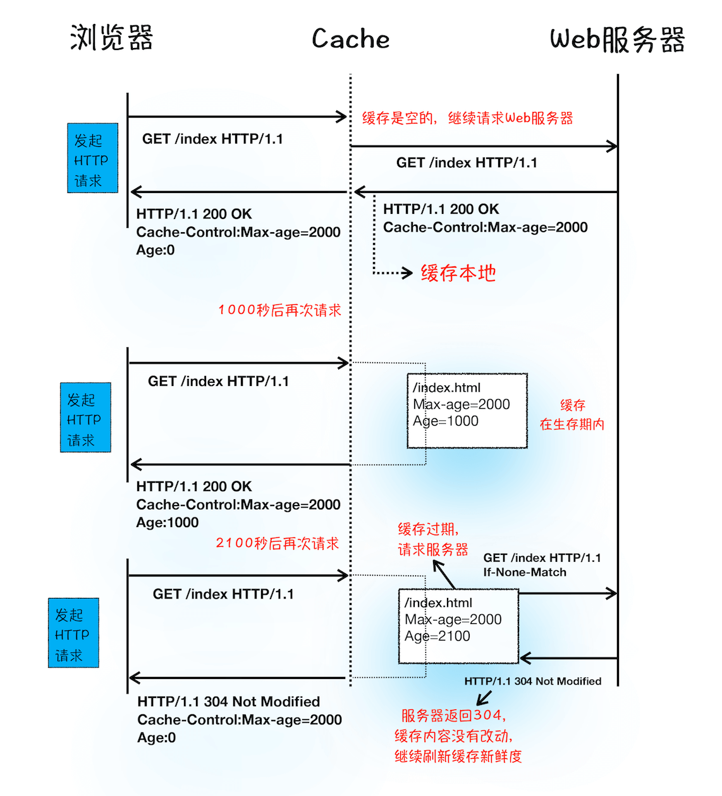

# 浏览器工作原理与实践

## Chrome 架构：仅仅打开了 1 个页面，为什么有 4 个进程？

> 线程 VS 进程

- 多线程可以并行处理任务，但是线程是不能单独存在的，它是由进程来启动和管理的 `一个进程就是一个程序的运行实例`

1. 进程中的任意一线程执行出错，都会导致整个进程的崩溃
2. 线程之间共享进程中的数据
3. 当一个进程关闭之后，操作系统会回收进程所占用的内存
4. 进程之间的内容相互隔离

> 单进程浏览器时代

- 单进程浏览器是指浏览器的所有功能模块都是运行在同一个进程里，这些模块包含了网络、插件、JavaScript 运行环境、渲染引擎和页面等。其实早在 2007 年之前，市面上浏览器都是单进程的；如此多的功能模块运行在一个进程里，是导致单进程浏览器不稳定、不流畅和不安全的一个主要因素

- 问题 1：不稳定

  1.  早期浏览器需要借助于插件来实现诸如 Web 视频、Web 游戏等各种强大的功能，但是插件是最容易出问题的模块，并且还运行在浏览器进程之中，所以一个插件的意外崩溃会引起整个浏览器的崩溃
  2.  渲染引擎模块也是不稳定的，通常一些复杂的 JavaScript 代码就有可能引起渲染引擎模块的崩溃

- 问题 2：不流畅

  1.  同一时刻只能有一个模块可以执行，如果一个模块脚本是无限循环的，所以当其执行时，它会独占整个线程，这样导致其他运行在该线程中的模块就没有机会被执行。因为浏览器中所有的页面都运行在该线程中，所以这些页面都没有机会去执行任务，这样就会导致整个浏览器失去响应，变卡顿

- 问题 3：不安全

  1. 插件可以使用 C/C++ 等代码编写，通过插件可以获取到操作系统的任意资源，当你在页面运行一个插件时也就意味着这个插件能完全操作你的电脑。如果是个恶意插件，那么它就可以释放病毒、窃取你的账号密码，引发安全性问题

> 浏览器多进程架构

- 浏览器进程。主要负责界面显示、用户交互、子进程管理，同时提供存储等功能。
- 渲染进程。核心任务是将 HTML、CSS 和 JavaScript 转换为用户可以与之交互的网页，排版引擎 Blink 和 JavaScript 引擎 V8 都是运行在该进程中，默认情况下，Chrome 会为每个 Tab 标签创建一个渲染进程。出于安全考虑，渲染进程都是运行在沙箱模式下。
- GPU 进程。其实，Chrome 刚开始发布的时候是没有 GPU 进程的。而 GPU 的使用初衷是为了实现 3D CSS 的效果，只是随后网页、Chrome 的 UI 界面都选择采用 GPU 来绘制，这使得 GPU 成为浏览器普遍的需求。
- 网络进程。主要负责页面的网络资源加载，之前是作为一个模块运行在浏览器进程里面的，直至最近才独立出来，成为一个单独的进程。
- 插件进程。主要是负责插件的运行，因插件易崩溃，所以需要通过插件进程来隔离，以保证插件进程崩溃不会对浏览器和页面造成影响。

> `总结：为什么仅仅打开了 1 个页面，为什么有 4 个进程？因为打开 1 个页面至少需要 1 个网络进程、1 个浏览器进程、1 个 GPU 进程以及 1 个渲染进程，共 4 个；如果打开的页面有运行插件的话，还需要再加上 1 个插件进程`

## HTTP 请求流程：为什么很多站点第二次打开速度会很快？

> 浏览器端发起 HTTP 请求流程

1. 构建请求
   1. 首先，浏览器构建请求行信息（如下所示），构建好后，浏览器准备发起网络请求; eg：GET /index.html HTTP1.1
2. 查找缓存

   1. 在真正发起网络请求之前，浏览器会先在浏览器缓存中查询是否有要请求的文件。其中，浏览器缓存是一种在本地保存资源副本，以供下次请求时直接使用的技术

3. 准备 IP 地址和端口

   1. 浏览器会请求 DNS 返回域名对应的 IP；浏览器还提供了 DNS 数据缓存服务
   2. 获取端口号。通常情况下，如果 URL 没有特别指明端口号，那么 HTTP 协议默认是 80 端口

4. 等待 TCP 队列

   1. Chrome 有个机制，同一个域名同时最多只能建立 6 个 TCP 连接，如果在同一个域名下同时有 10 个请求发生，那么其中 4 个请求会进入排队等待状态，直至进行中的请求完成。

5. 建立 TCP 连接
6. 发送 HTTP 请求

> 服务器端处理 HTTP 请求流程

1. 返回请求
2. 断开连接
3. 重定向 (重定向的网址正是包含在响应头的 Location 字段中，接下来，浏览器获取 Location 字段中的地址，并使用该地址重新导航，这就是一个完整重定向的执行流程)

> `总结：为什么很多站点第二次打开速度会很快？如果第二次页面打开很快，主要原因是第一次加载页面过程中，缓存了一些耗时的数据。那么，哪些数据会被缓存呢？从上面介绍的核心请求路径可以发现，DNS 缓存和页面资源缓存这两块数据是会被浏览器缓存的。其中，DNS 缓存比较简单，它主要就是在浏览器本地把对应的 IP 和域名关联起来; 重点是浏览器资源缓存如下图`

- 总的来说是因为这些网站把很多资源都缓存在了本地，浏览器缓存直接使用本地副本来回应请求，而不会产生真实的网络请求，从而节省了时间。同时，DNS 数据也被浏览器缓存了，这又省去了 DNS 查询环节

## 导航流程：从输入 URL 到页面展示，这中间发生了什么？

> 这个过程可以大致描述为如下。

- 首先，浏览器进程接收到用户输入的 URL 请求，浏览器进程便将该 URL 转发给网络进程
- 然后，在网络进程中发起真正的 URL 请求
- 接着网络进程接收到了响应头数据，便解析响应头数据，并将数据转发给浏览器进程
- 浏览器进程接收到网络进程的响应头数据之后，发送“提交导航 (CommitNavigation)”消息到渲染进程
- 渲染进程接收到“提交导航”的消息之后，便开始准备接收 HTML 数据，接收数据的方式是直接和网络进程建立数据管道
- 最后渲染进程会向浏览器进程“确认提交”，这是告诉浏览器进程：“已经准备好接受和解析页面数据了”
- 浏览器进程接收到渲染进程“提交文档”的消息之后，便开始移除之前旧的文档，然后更新浏览器进程中的页面状态

> 详解

1. 用户输入

   - 当用户在地址栏中输入一个查询关键字时，地址栏会判断输入的关键字是**搜索内容**，还是**请求的 URL**
   - 如果是搜索内容，地址栏会使用浏览器默认的搜索引擎，来合成新的带搜索关键字的 URL。
   - 如果判断输入内容符合 URL 规则；比如输入的是 naparte.github.io，那么地址栏会根据规则，把这段内容加上协议，合成为完整的 URL https://naparte.github.io。
   - 当用户输入关键字并键入回车之后，这意味着当前页面即将要被替换成新的页面，`不过在这个流程继续之前，浏览器还给了当前页面一次执行 beforeunload 事件的机会`，beforeunload 事件允许页面在退出之前执行一些数据清理操作，还可以询问用户是否要离开当前页面，比如当前页面可能有未提交完成的表单等情况，因此用户可以通过 beforeunload 事件来取消导航，让浏览器不再执行任何后续工作

2. URL 请求过程

   - 浏览器进程会通过进程间通信（IPC）把 URL 请求发送至网络进程，网络进程接收到 URL 请求后，会在这里发起真正的 URL 请求流程
   - 首先，网络进程会查找本地缓存是否缓存了该资源。如果有缓存资源，那么直接返回资源给浏览器进程
   - 如果在缓存中没有查找到资源，那么直接进入网络请求流程 （这请求前的第一步是要进行 DNS 解析，以获取请求域名的服务器 IP 地址。如果请求协议是 HTTPS，那么还需要建立 TLS 连接）
   - 利用 IP 地址和服务器建立 TCP 连接。连接建立之后，浏览器端会构建请求行、请求头等信息，并把和该域名相关的 Cookie 等数据附加到请求头中，然后向服务器发送构建的请求信息
   - 服务器接收到请求信息后，会根据请求信息生成响应数据并发给网络进程。等网络进程接收了响应行和响应头之后，就开始解析响应头的内容了
     - （1）重定向: 在接收到服务器返回的响应头后，网络进程开始解析响应头，如果发现返回的状态码是 301 或者 302，那么说明服务器需要浏览器重定向到其他 URL。这时网络进程会从响应头的 Location 字段里面读取重定向的地址，然后再发起新的 HTTP 或者 HTTPS 请求，一切又重头开始
     - （2）响应数据类型处理：如果 Content-Type 字段的值被浏览器判断为下载类型，那么该请求会被提交给浏览器的下载管理器，同时该 URL 请求的导航流程就此结束。但如果是 HTML，那么浏览器则会继续进行导航流程。

3. 准备渲染进程

   - `默认情况下，Chrome 会为每个页面分配一个渲染进程，也就是说，每打开一个新页面就会配套创建一个新的渲染进程`
   - 同一站点（same-site）情况下多个页面会同时运行在一个渲染进程中 [同一站点”定义为根域名（例如，geekbang.org）加上协议（例如，https:// 或者 http://），还包含了该根域名下的所有子域名和不同的端口；比如下面这三个都是属于同一站点 ]
     - https://time.geekbang.org
     - https://www.geekbang.org
     - https://www.geekbang.org:8080

4. 提交文档

   - 所谓提交文档，就是指浏览器进程将网络进程接收到的 HTML 数据提交给渲染进程，具体流程是这样的：
     - 首先当浏览器进程接收到网络进程的响应头数据之后，便向渲染进程发起“提交文档”的消息；
     - 渲染进程接收到“提交文档”的消息后，会和网络进程建立传输数据的“管道”；
     - 等文档数据传输完成之后，渲染进程会返回“确认提交”的消息给浏览器进程；
     - 浏览器进程在收到“确认提交”的消息后，会更新浏览器界面状态，包括了安全状态、地址栏的 URL、前进后退的历史状态，并更新 Web 页面
   - 这也就解释了为什么在浏览器的地址栏里面输入了一个地址后，之前的页面没有立马消失，而是要加载一会儿才会更新页面

5. 渲染阶段
   - 一旦文档被提交，渲染进程便开始页面解析和子资源加载了

## 渲染流程：HTML、CSS 和 JavaScript，是如何变成页面的？

- 按照渲染的时间顺序: 构建 DOM 树、样式计算、布局阶段、分层、绘制、分块、光栅化和合成

1. 构建 DOM 树

   - 因为浏览器无法直接理解和使用 HTML，所以需要将 HTML 转换为浏览器能够理解的结构——DOM 树

2. 样式计算（Recalculate Style）

   - 2.1 把 CSS 转换为浏览器能够理解的结构; CSS 样式来源主要有三种：通过 link 引用的外部 CSS 文件、\<style\>标记内的 CSS、元素的 style 属性内嵌的 CSS
   - 2.2 转换样式表中的属性值，使其标准化
   - 2.3 计算出 DOM 树中每个节点的具体样式 (CSS 的继承规则和层叠规则)

3. 布局阶段

   - 计算出 DOM 树中可见元素的几何位置，把这个计算过程叫做布局
   - 创建布局树: 在显示之前，还要额外地构建一棵只包含可见元素布局树
   - 布局计算: 计算布局树节点的坐标位置

4. 分层

   - 渲染引擎还需要为特定的节点生成专用的图层，并生成一棵对应的图层树（LayerTree）
   - `打开 Chrome 的“开发者工具”，选择“Layers”标签，就可以可视化页面的分层情况`
   - 并不是布局树的每个节点都包含一个图层，如果一个节点没有对应的层，那么这个节点就从属于父节点的图层
   - > 那么需要满足什么条件，渲染引擎才会为特定的节点创建新的图层呢？通常满足下面两点中任意一点的元素就可以被提升为单独的一个图层。
     - 第一点，拥有层叠上下文属性的元素会被提升为单独的一层。 [MDN 友情链接](https://developer.mozilla.org/zh-CN/docs/Web/CSS/CSS_positioned_layout/Understanding_z-index/Stacking_context)
     - 第二点，需要剪裁（clip）的地方也会被创建为图层。

5. 图层绘制
6. 栅格化（raster）操作

   - 合成线程会按照视口附近的图块来优先生成位图，实际生成位图的操作是由栅格化来执行的。所谓栅格化，是指将图块转换为位图
   - 在光栅化线程池中，将视口附近的图块优先生成位图（栅格化执行该操作）；
   - 快速栅格化：GPU 加速，生成位图（GPU 进程）。

7. 合成和显示

   - 绘制图块命令——DrawQuad，提交给浏览器进程；
   - 浏览器进程的 viz 组件，根据 DrawQuad 命令，绘制在屏幕上。

> 更新了元素的几何属性（重排）

- 如果通过 JavaScript 或者 CSS 修改元素的几何位置属性，例如改变元素的宽度、高度等，那么浏览器会触发重新布局，解析之后的一系列子阶段，这个过程就叫重排。无疑，`重排需要更新完整的渲染流水线，所以开销也是最大的`

> 更新元素的绘制属性（重绘）

- 如果修改了元素的背景颜色，那么布局阶段将不会被执行，因为并没有引起几何位置的变换，所以就直接进入了绘制阶段，然后执行之后的一系列子阶段，这个过程就叫重绘。`相较于重排操作，重绘省去了布局和分层阶段，所以执行效率会比重排操作要高一些`

> 直接合成阶段

- 如果使用了 CSS 的 transform 来实现动画效果，这可以避开重排和重绘阶段，直接在非主线程上执行合成动画操作。这样的效率是最高的，因为是在非主线程上合成，并没有占用主线程的资源，另外也避开了布局和绘制两个子阶段，`所以相对于重绘和重排，合成能大大提升绘制效率`
