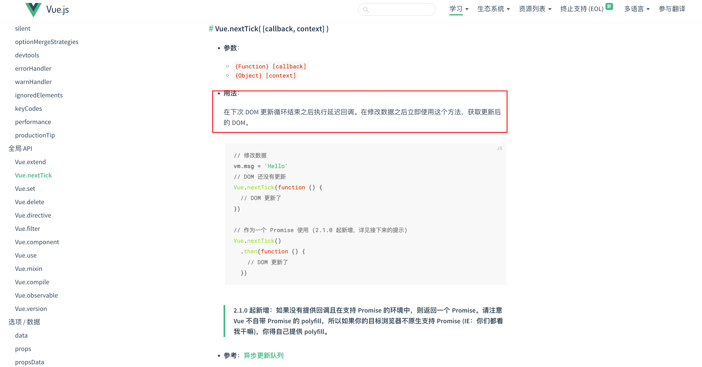

# nextTick

## nextTick 是什么

- `官方定义`：在下次 DOM 更新循环结束之后执行延迟回调。在修改数据之后立即使用这个方法，获取更新后的 DOM



## nextTick 解决了什么问题

```javascript
// {{num}}
for (let i = 0; i < 100000; i++) {
  num = i;
}
```

- 如果没有 nextTick 更新机制，那么 num 每次更新值都会触发视图更新，有了 nextTick 机制，只需要更新一次，所以 nextTick 本质是一种优化策略

### Vue 的异步更新

可能你还没有注意到，`Vue 异步执行 DOM 更新`。只要观察到数据变化，Vue 将开启一个队列，并`缓冲在同一事件循环中发生的所有数据改变`。如果同一个 watcher 被多次触发，只会被`推入到队列中一次`。这种在缓冲时去除重复数据对于避免不必要的计算和 DOM 操作上非常重要。然后，在下一个的事件循环“tick”中，Vue 刷新队列并执行实际 (已去重的) 工作。

- `总结`： DOM 更新是异步的：当我们在更新数据后立马去获取 DOM 中的内容是会发现获取的依然还是旧的内容。

## nextTick 原理

### watcher

```javascript
// watcher.js
// 当依赖发生变化时，触发更新
update() {
  if(this.lazy) {
    // 懒执行会走这里, 比如computed
    this.dirty = true
  }else if(this.sync) {
    // 同步执行会走这里，比如this.$watch() 或watch选项，传递一个sync配置{sync: true}
    this.run()
  } else {
    // 将当前watcher放入watcher队列， 一般都是走这里
    queueWatcher(this)
  }
}

```

### scheduler

```javascript
// scheduler.js
/*将一个观察者对象push进观察者队列，在队列中已经存在相同的id则该观察者对象将被跳过，除非它是在队列被刷新时推送*/
export function queueWatcher(watcher: Watcher) {
  /*获取watcher的id*/
  const id =
    watcher.id; /*检验id是否存在，已经存在则直接跳过，不存在则标记在has中，用于下次检验*/
  if (has[id] == null) {
    has[id] = true; // 如果flushing为false， 表示当前watcher队列没有在被刷新，则watcher直接进入队列
    if (!flushing) {
      queue.push(watcher);
    } else {
      // 如果watcher队列已经在被刷新了，这时候想要插入新的watcher就需要特殊处理
      // 保证新入队的watcher刷新仍然是有序的
      let i = queue.length - 1;
      while (i >= 0 && queue[i].id > watcher.id) {
        i--;
      }
      queue.splice(Math.max(i, index) + 1, 0, watcher);
    } // queue the flush
    if (!waiting) {
      // wating为false，表示当前浏览器的异步任务队列中没有flushSchedulerQueue函数
      waiting = true; // 这就是我们常见的this.$nextTick
      nextTick(flushSchedulerQueue);
    }
  }
}
```

- `总结`： 前面两段代码 vue 并`不是跟随数据变化立即更新视图`的，它而是`维护了一个 watcher 队列`，并且 id 重复的 watcher 只会推进队列一次，因为我们关心的只是最终的数据，而不是它更新多少次。等到下一个 tick 时，这些 watcher 才会从队列中取出，更新视图

### nextTick

```javascript
// next-tick.js
const callbacks = []
let pending = false
​
// 批处理
function flushCallbacks () {
  pending = false
  const copies = callbacks.slice(0)
  callbacks.length = 0
  // 依次执行nextTick的方法
  for (let i = 0; i < copies.length; i++) {
    copies[i]()
  }
}
​
export function nextTick (cb, ctx) {
  let _resolve
  callbacks.push(() => {
    if (cb) {
      try {
        cb.call(ctx)
      } catch (e) {
        handleError(e, ctx, 'nextTick')
      }
    } else if (_resolve) {
      _resolve(ctx)
    }
  })
  // 因为内部会调nextTick，用户也会调nextTick，但异步只需要一次
  if (!pending) {
    pending = true
    timerFunc()
  }
  // 执行完会会返回一个promise实例，这也是为什么$nextTick可以调用then方法的原因
  if (!cb && typeof Promise !== 'undefined') {
    return new Promise(resolve => {
      _resolve = resolve
    })
  }
}

```

### timerFunc

```javascript
// timerFunc
// promise.then -> MutationObserver -> setImmediate -> setTimeout
// vue3 中不再做兼容性处理，直接使用的就是promise.then 任性
​
if (typeof Promise !== 'undefined' && isNative(Promise)) {
  const p = Promise.resolve()
  timerFunc = () => {
    p.then(flushCallbacks)
    if (isIOS) setTimeout(noop)
  }
  isUsingMicroTask = true
} else if (!isIE && typeof MutationObserver !== 'undefined' && (
  isNative(MutationObserver) ||
  // PhantomJS and iOS 7.x
  MutationObserver.toString() === '[object MutationObserverConstructor]'
)) {
  let counter = 1
  const observer = new MutationObserver(flushCallbacks) // 可以监听DOM变化，监听完是异步更新的
  // 但这里并不是想用它做DOM监听，而是利用它是微任务这一特点
  const textNode = document.createTextNode(String(counter))
  observer.observe(textNode, {
    characterData: true
  })
  timerFunc = () => {
    counter = (counter + 1) % 2
    textNode.data = String(counter)
  }
  isUsingMicroTask = true
} else if (typeof setImmediate !== 'undefined' && isNative(setImmediate)) {
  timerFunc = () => {
    setImmediate(flushCallbacks)
  }
} else {
  // Fallback to setTimeout.
  timerFunc = () => {
    setTimeout(flushCallbacks, 0)
  }
}

```

## 总结

### `一般更新 DOM 是同步的`

- 每一轮事件循环的最后会进行一次页面渲染，并且从上面我们知道渲染过程也是个宏任务，这里可能会有个误区，`那就是 DOM tree 的修改是同步的，只有渲染过程是异步的，也就是说我们在修改完 DOM 后能够立即获取到更新的 DOM`

```html
<body>
  <div id="title">少年听雨歌楼上，红烛昏罗帐；</div>
  <script>
    title.innerText = "壮年听雨客舟中，江阔云低，断雁叫西风";
    console.log(title); //打印： 壮年听雨客舟中，江阔云低，断雁叫西风
  </script>
</body>
```

### 既然更新 DOM 是个同步的过程，那为什么 Vue 却需要借用$nextTick 来处理呢？

- 答案很明显，因为 Vue 处于性能考虑，Vue 会将用户同步修改的多次数据缓存起来，等同步代码执行完，说明这一次的数据修改就结束了，然后才会去更新对应 DOM，一方面可以省去不必要的 DOM 操作，比如同时修改一个数据多次，只需要关心最后一次就好了，另一方面可以将 DOM 操作聚集，提升 render 性能

### 为什么优先使用微任务？

- 因为微任务一定比宏任务优先执行，
- 如果 nextTick 是微任务，它会在当前同步任务执行完立即执行所有的微任务，也就是修改 DOM 的操作也会在当前 tick 内执行，等本轮 tick 任务全部执行完成，才是开始执行 UI rendering。
- 如果 nextTick 是宏任务，它会被推进宏任务队列，并且在本轮 tick 执行完之后的某一轮执行，
- 注意，它并不一定是下一轮，因为你不确定宏任务队列中它之前还有所少个宏任务在等待着。所以为了能够尽快更新 DOM，Vue 中优先采用的是微任务，并且在 Vue3 中，它没有了兼容判断，直接使用的是 promise.then 微任务，不再考虑宏任务了。

## 参考文献

- [Vue.js v2.x API 文档 - nextTick](https://v2.cn.vuejs.org/v2/api/#Vue-nextTick)

- https://github.com/vuejs/vue/blob/v2.6.14/src/core/util/next-tick.js
- https://github.com/vuejs/vue/blob/v2.6.14/src/core/observer/scheduler.js
