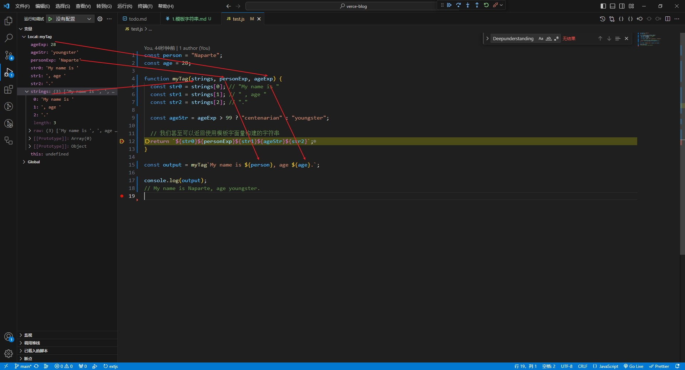

# 模板字符串

## 常见用法

```javascript
let expression = "Naparte";

let myName = `My name is ${expression} `;
```

## 标签用法

- 有点像 String 的 replace() 替换函数。

```javascript
const person = "Naparte";
const age = 28;

function myTag(strings, personExp, ageExp) {
  const str0 = strings[0]; // "My name is "
  const str1 = strings[1]; // " , age "
  const str2 = strings[2]; // "."

  const ageStr = ageExp > 99 ? "centenarian" : "youngster";

  // 我们甚至可以返回使用模板字面量构建的字符串
  return `${str0}${personExp}${str1}${ageStr}${str2}`;
}

const output = myTag`My name is ${person}, age ${age}.`;

console.log(output);
// My name is Naparte, age youngster.
```



## 案例说明

- 一段邀请说明

```text
诚挚邀请 xxx 先生（女士）作为选手（裁判/记分员/摄影师）于 xxxx年xx月xx日参加上海张江杯垂钓竞技大赛。主办方：上海市浦东钓鱼协会
诚挚邀 xxx 先生（女士）参加2029年度FrontEnd前端技术大会，作为xxx （微前端/webpack/可视化）领域带头人。本次大会旨在为广大前端开发者提供一个交流、学习和展示的平台，共同探讨前端技术的最新趋势和发展方向。主办方：深圳市前端开发者协会
```

```javascript
const data = {
  name: "Naparte",
  sex: 0,
  role: 1,
  time: new Date().getTime(),
};
const invite = function (arrs, nameExp, sexExp, roleExp, timeExp) {
  let strName = nameExp;
  // 性别处理
  let strSex = ["先生", "女士"][sexExp];
  // 角色处理
  const role = {
    1: "微前端",
    2: "webpack",
    3: "可视化",
    4: "工程化",
  };
  let strRole = role[roleExp];
  // 日期处理
  let strTime = new Date(timeExp).toLocaleDateString(undefined, {
    year: "numeric",
    month: "long",
    day: "numeric",
  });

  // 输出内容
  let output = [arrs[0]];

  [strName, strSex, strRole, strTime].forEach((str, index) => {
    output.push(str, arrs[index + 1] || "");
  });

  return output.join("");
};

let content = invite`诚挚邀 ${data.name}${data.sex}，作为 ${data.role} 领域优秀开发，参加${data.time}度FrontEnd前端技术大会。本次大会旨在为广大前端开发者提供一个交流、学习和展示的平台，共同探讨前端技术的最新趋势和发展方向。主办方：深圳市前端开发者协会`;

console.log(content);
// 诚挚邀 Naparte先生，作为 微前端 领域优秀开发，参加2023年12月13日度FrontEnd前端技术大会。本次大会旨在为广大前端开发者提供一个交流、学习和展示的平台，共同探讨前端技术的最新趋势和发展方向。主办方：深圳市前端
// 开发者协会;
```

- 实现效果：模板只负责填充数据，至于最终数据的返回，统一在标签函数中处理
