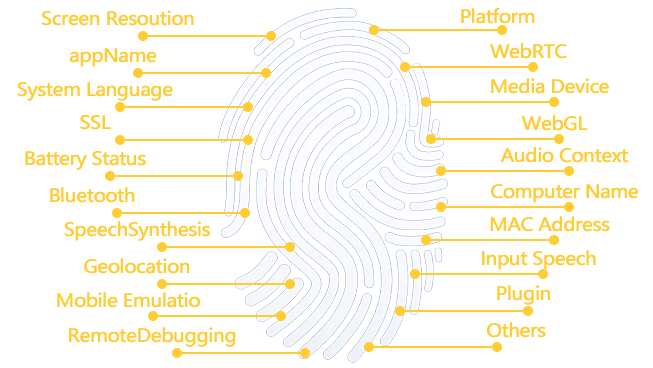

# 浏览器指纹（Browser Fingerprinting）

## 浏览器指纹是什么？

- 一种在线追踪技术，通过收集和分析用户浏览器的特定配置信息来唯一标识或区分不同的网络客户端

- 这些信息包括但不限于：`浏览器类型及版本`、`操作系统及其版本`、`屏幕分辨率`、`字体列表`（使用 CSS3 的@font-face 规则可以检测）、`插件和扩展列表`、`时区设置`、`系统语言`、`WebGL图形渲染信息`、`HTTP请求头部字段`（如 User-Agent）、`HTML5 API暴露的信息`（例如 canvas 画布指纹、音频上下文指纹等）

- 通过组合这些通常不会改变且在大多数情况下是公开可见的属性，网站能够生成一个独特的“指纹”，即使用户清除了 Cookie 或者使用了隐私浏览模式，也难以完全避免被识别和追踪。这种技术常被用于广告定向、欺诈检测、账户关联性检测等方面，但同时也引发了对用户隐私保护的关注与讨论。



## 浏览器指纹的价值

- 理论上，`无登录的状态下，并且浏览器中无法读取或存储持久 cookie，无法读取客户端的 IP`，或同一个设备上切换不同的浏览器的情况下，我们仍然可以通过浏览器指纹完全或者部分识别单个设备

- `用户追踪与识别`：例如在一个内容分发网站上，用户 A 喜欢浏览二次元的内容，通过浏览器指纹记录这个兴趣，那么下次用户不需要登录即可向 A 用户推送二次元的信息

- `安全性与防欺诈`：在需要高安全性的领域中，浏览器指纹技术可以帮助企业`识别潜在的恶意用户或机器人`，通过对访问请求进行指纹识别来提高系统的安全性和防止欺诈交易。

- `合规与监管`：在某些法律要求严格的地区，通过浏览器指纹可以辅助验证用户身份，确保服务仅向符合年龄、地域等条件的用户提供，从而达到合规目的。

- `数据分析`：企业和研究机构可以通过收集并分析浏览器指纹数据，了解用户群体的行为模式、设备分布以及市场趋势等信息。

## 浏览器指纹的发展

### 第一代：状态化追踪

- 主要依赖于用户登录时产生的 Cookie 和 evercookie 等技术进行追踪，这些信息需要用户的交互行为（如登录）才能获得。

### 第二代：静态浏览器指纹

- 开始形成“浏览器指纹”的概念，不再局限于登录状态的标识。
- 通过收集浏览器的基本属性，如 User-Agent 字符串、插件信息、系统字体列表等具有区分度的特征值来构建指纹。
- 这些特征相对稳定，不随用户会话或浏览历史而改变。

### 第三代：动态浏览器指纹

- 技术进一步发展，开始利用 Canvas 绘图、WebGL 渲染、音频上下文等多种 HTML5 API 暴露出来的细微差异性数据生成指纹。
- 这些动态特征能捕捉到浏览器更深层次的信息，包括硬件相关的特性，从而极大提高了用户识别的准确度。

### 第四代：行为指纹

- 引入了用户行为模式作为指纹的一部分，例如鼠标移动轨迹、页面滚动速度、键盘敲击间隔等非设备固有特征。
- 行为指纹不仅包含静态和动态特征，还结合了时间序列的行为数据，使得追踪更为精准且难以规避。

## 浏览器基本指纹采集

- 浏览器基本指纹是指那些不依赖于用户交互或网站存储的本地数据（如 Cookie），仅仅通过`分析客户端浏览器的基本配置信息就可以收集到的`、用于区分不同浏览器环境的一组属性
- 包括屏幕分辨率、硬件类型、操作系统、用户代理（User agent）、系统字体、语言、浏览器插件 、浏览器扩展、浏览器设置 、时区差等众多信息

  | 类型       | 属性                             | 获取方式                                         |
  | ---------- | -------------------------------- | ------------------------------------------------ |
  | 浏览器特征 | User-Agent                       | `navigator.userAgent`                            |
  | 浏览器特征 | 浏览器语言                       | `navigator.language`                             |
  | 浏览器特征 | 插件列表                         | `navigator.plugins`                              |
  | 系统特征   | 操作系统信息                     | `navigator.platform`                             |
  | 时区特征   | 本地时间与格林威治时间差（分钟） | `new Date().getTimezoneOffset()`                 |
  | 时区特征   | 完整时区信息                     | **需查询服务器获取**                             |
  | 时区特征   | 地理位置经纬度                   | `navigator.geolocation.getCurrentPosition`       |
  | 时区特征   | 地理区域名称                     | **需查询服务器获取**                             |
  | 时区特征   | IP 地址                          | **需通过服务器接口获取**                         |
  | 硬件特征   | 最大同时触摸点数                 | `navigator.maxTouchPoints`                       |
  | 硬件特征   | 可用逻辑处理器核心数             | `navigator.hardwareConcurrency`                  |
  | 屏幕特征   | 屏幕宽高                         | `screen.width` 和 `screen.height`                |
  | 屏幕特征   | 屏幕分辨率与色彩深度组合         | `screen.width、screen.height、screen.colorDepth` |

注：

1. 对于需要通过服务器获取的信息，客户端 JavaScript 通常无法直接获取详细地理区域、IP 地址以及完整时区信息。
2. 使用`navigator.geolocation.getCurrentPosition`获取经纬度时，需要用户的明确授权，并且在支持该 API 且运行在安全环境下的浏览器中调用。

## 浏览器高级指纹采集

### Canvas 指纹

- 描述：通过调用 Canvas API，绘制图形并获取渲染后的像素数据，不同浏览器和设备组合会导致细微差异。
- 获取方式：

```javascript
var canvas = document.createElement("canvas");
var ctx = canvas.getContext("2d");
ctx.textBaseline = "top";
ctx.font = "14px Arial";
ctx.fillText("Hello, world", 0, 0);
var imageData = ctx.getImageData(0, 0, canvas.width, canvas.height).data;
// imageData 为一维数组，包含了Canvas渲染后的像素信息
```

### WebGL 指纹

- 描述：利用 WebGL API 获取图形处理器相关信息，不同的 GPU 会产生独特的着色器编译结果。
- 获取方式：

```javascript
var gl = document.createElement("canvas").getContext("webgl");
var fingerprint = [];
fingerprint.push(gl.getParameter(gl.VENDOR));
fingerprint.push(gl.getParameter(gl.RENDERER));
// 可以进一步提取更多与硬件相关的参数
```

- [FingerprintJS Canvas 源代码](https://github.com/fingerprintjs/fingerprintjs/blob/c411aff111e5c79cdc37608d42632d4a66a8c1dc/src/sources/canvas.ts)

### 音频(AudioContext) 指纹

- 描述：通过 AudioContext 分析音频处理能力，不同设备的音频 API 可能存在差异性。
- 获取方式

```javascript
var audioContext = new (window.AudioContext || window.webkitAudioContext)();
var fingerprint = audioContext.destination.channelCount;
```

- [FingerprintJS Audio 源代码](https://github.com/fingerprintjs/fingerprintjs/blob/c411aff111e5c79cdc37608d42632d4a66a8c1dc/src/sources/audio.ts)

### WebGL 指纹

- WebGL 指纹是一种通过浏览器的 WebGL（Web Graphics Library）API 收集设备硬件和图形处理器相关信息来创建用户唯一标识的方法。
- 由于不同的设备和显卡在处理 WebGL 任务时可能会产生细微的差异，这些差异可以被用来构建一个独特的指纹。
- 获取方式

```javascript
const gl = canvas.getContext("webgl");
const fingerprintData = {
  vendor: gl.getParameter(gl.VENDOR),
  renderer: gl.getParameter(gl.RENDERER),
  // 还可以添加其他参数...
};
```

- [FingerprintJS WebGL 源代码](https://github.com/fingerprintjs/fingerprintjs/blob/c411aff111e5c79cdc37608d42632d4a66a8c1dc/src/sources/webgl.ts)

### WebRTC

- WebRTC（Web Real-Time Communication）是一种允许网页浏览器进行实时通信（RTC）的技术，无需安装插件或软件。
- 它使得用户能够在浏览器之间直接交换音频、视频和数据流，支持点对点的音视频通话、屏幕共享等功能。
- 在浏览器指纹方面，WebRTC 也可以作为获取设备信息的一个来源，尽管这不是它的主要用途。
- 通过 `navigator.mediaDevices.getUserMedia() API` 或者相关的
- WebRTC(三个主要的 APIMediaStream、RTCPeerConnection 和 RTCDataChannel) 接口，可以访问到一些设备特定的信息，例如：

  - `本地IP地址`：WebRTC 实现中可能暴露出本地网络配置的一部分，如私有 IPv4 或 IPv6 地址。
  - `硬件编解码器信`息：不同的设备可能支持不同的音频和视频编解码器，这些信息可以通过 WebRTC 获取。

```javascript
if (navigator.mediaDevices && navigator.mediaDevices.enumerateDevices) {
  navigator.mediaDevices.enumerateDevices().then(function (devices) {
    devices.forEach(function (device) {
      console.log(
        device.kind + ": " + device.label + " id = " + device.deviceId
      );

      // 对于音频输入设备，还可以查询其具体属性
      if (device.kind === "audioinput") {
        // 不建议在实际应用中尝试获取IP等敏感信息
        // 这里仅作为展示设备信息的例子
        // WebRTC IP泄露问题已经得到现代浏览器的关注并被逐步修复
      }
    });
  });
}
```

- 注意：现代浏览器已经采取措施限制 WebRTC 泄漏过多的本地设备信息，比如不再暴露本地 IP 地址

## 参考文献

- [电子前沿基金会浏览器指纹测试](https://coveryourtracks.eff.org/)

- [FingerprintJS GitHub 仓库](https://github.com/fingerprintjs/fingerprintjs)

- [浏览器指纹技术及其防范方法](https://juejin.cn/post/7125260071990198308#heading-4)
